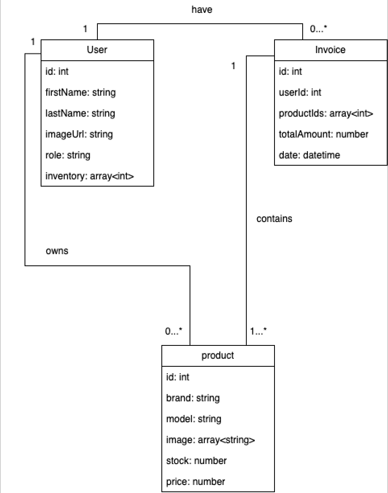

# S4_ServerSide_project

## UML Diagram

## User Management

- Registeration & logi (with authentication, possibly JWT or OAuth)
- User roles (admin , customer, vendor)
- Profile amnagement

# API & Security

- RESTful API with Express.js
- Middleware for authentication and authorization
- Rate limiting & Validation

## Technologies $ Resources

- Node.js (runtime environment)
- Express.js (freamework for APIs)
- JWT - Jason Web Token (authentication & security)
- Multer (for handling fileuplaods)
- MongoDB (NoSQL, using mangoose for schemas)
- Hosting: render
- `dotenv` for managing environment variables
- helmet & CORS for security